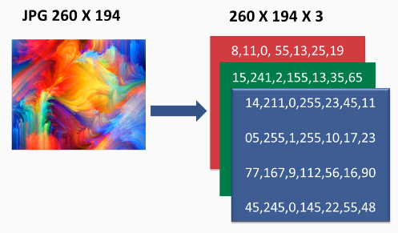
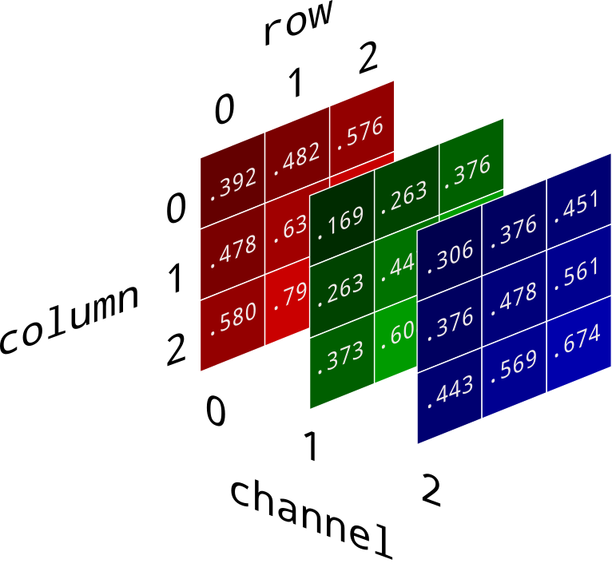

# Indice
- [Setup](#setup)
- [Imagenes](#imagenes)
- [OpenCV](#opencv)

<small><i><a href='http://ecotrust-canada.github.io/markdown-toc/'>Table of contents generated with markdown-toc</a></i></small>

# Setup

# Imagenes
Las imagenes **RGB** se componen de una matriz de 3 canales (red, blue & green) 

 
Convertir una imagen a **blanco y negro** hace que funcione de manera binaria y mucho mas simple para la maquina 

# OpenCV
