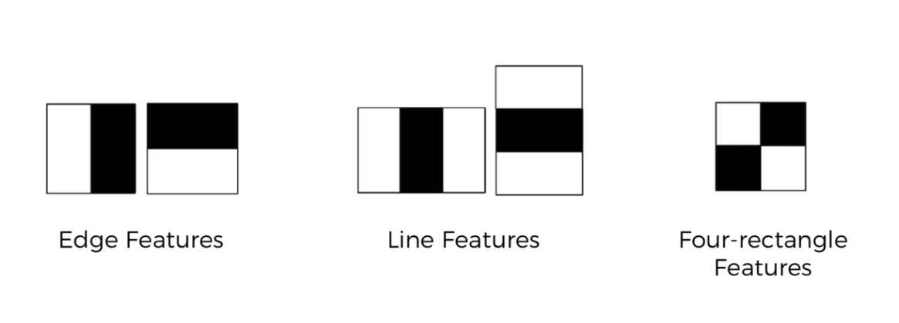
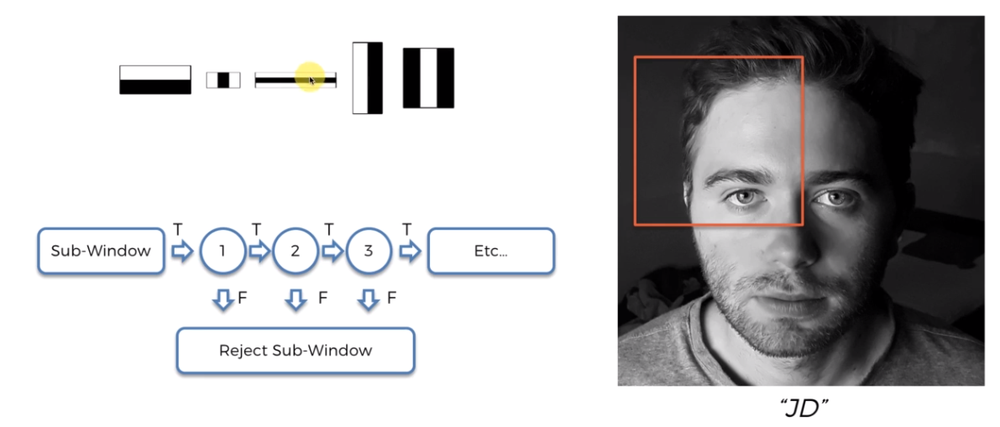
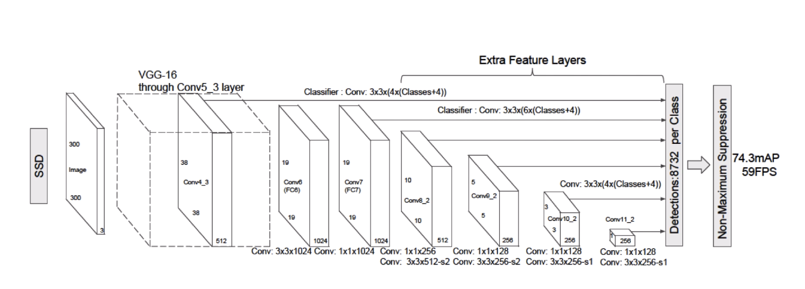
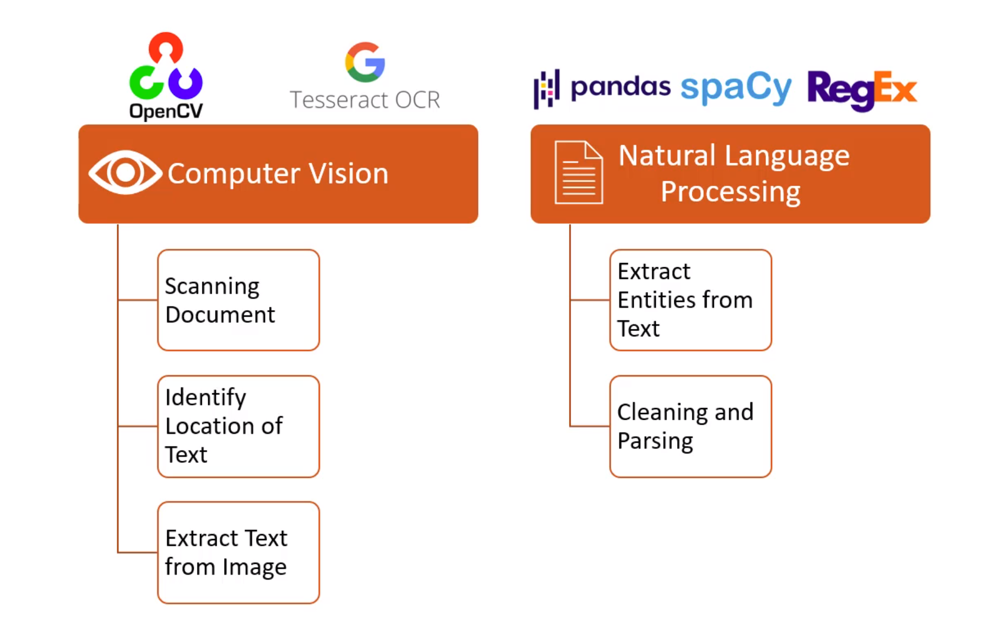

- [Setup](#setup)
- [Imagenes](#imagenes)
  * [Algoritmos](#algoritmos)
    + [Viola-Jones](#viola-jones)
    + [Haar-like Features](#haar-like-features)
  * [Integral Image](#integral-image)
  * [Cascading](#cascading)
- [SSD](#ssd)
- [Multi-Box](#multi-box)
- [OpenCV](#opencv)
- [Generative Adversarial Networks (GANs)](#generative-adversarial-networks--gans-)
    + [Generator (G)](#generator--g-)
    + [Discriminator (D)](#discriminator--d-)
  * [Entrenamiento](#entrenamiento)
  * [Usos de GANs](#usos-de-gans)
- [Deep Learning](#deep-learning)
- [OCR](#ocr)
  * [Tesseract](#tesseract)
    + [Setup](#setup-1)
  * [Spacy](#spacy)
    + [Setup](#setup-2)

# Setup

Add project
```
python3 -m venv entorno
source entorno/bin/activate
pip freeze >> requirements.txt
```

```sh
pip install opencv-python
```

# Imagenes
Las imagenes **RGB** se componen de una matriz de 3 canales (red, blue & green)<br />

<br />
Convertir una imagen a **blanco y negro** hace que funcione de manera binaria y mucho mas simple para la maquina<br />

## Algoritmos

### Viola-Jones
<br />
Va desde arriba a la derecha hasta abajo a la izquierda, buscando ojos, nariz, boca. Hasta que detecta el rostro (encontrando todo)<br />
Este algoritmo funciona solo para rostros frontales<br />

### Haar-like Features
<br />
Detecta las lineas mas oscuras, como en la boca (lineal)<br />
Las pestañas, detecta el cambio de color, la division<br />

<br />
Deteccion de los vaores entre 0 y 1 (escala de grises)<br />
<br />
Para calcular que representa el blanco y el negro se calcula la media de los valores<br />
<br />

## Integral Image
Es muy costoso hacer una sumatoria de cuadrados para cada uno, por eso utilizamos una imagen integral<br />
Genera matriz sumando los valores hasta la izquierda y hasta arriba<br />
<br />
De esta manera solo tenemos que realizar la ecuacion con estos 4 valores, por mas que el cuadro contenga miles de pixels<br />

<br />

<br />
<br />


## Cascading 
<br />
<br />


# SSD
Single Shot detection><br />
<br />


# Multi-Box
Se generan muchos box en cada punto, y de esa manera buscamos detectar objetos<br />
POr ejemplo, detecta y coloca en rojo cuando encuentra una persona<br />
<br />
<br />


# OpenCV
OpenCV no utiliza redes neuronales, por eso solo importamos **cv2**, solo utiliza cascade<br />
Es ideal para deteccion facial<br />


# Generative Adversarial Networks (GANs)
Redes generativas de confrontacion, pueden crear imagenes que no existian.
Se divide en 2:

### Generator (G)
Genera las imagenes en base al ruido, genera imagenes aleatoreas que utilizaremos para entrenar al **Discriminator**, luego que el discriminator termina hacemos la propagacion hacia atras y volvemos a crear imagenes en base a lo que aprendio el **D**

### Discriminator (D)
Rival de **G**, aprende la las imagenes de animales, personas, etc.. <br />
Discrimina de lo que son perros y lo que no son perros, por ejemplo.<br />
Me viene una imagen y devuelvo 1 si es un perro o un 0 si no lo es <br />
<br />

## Entrenamiento
<br />
<br />
<br />

## Usos de GANs
- Generar imagenes
- Modificar imagenes
- Super resolucion
- Generador de Speech

# Deep Learning
El concepto de deep learning existio siempre, lo que le da tanto impacto hoy en dia es el aumento de la capacidad<br />
<br />

# OCR
Tecnicas para localizar y extraer texto, para esto utilizaremos 2 tecnologias:
- Computer Vision
  - Escanear documento
  - Identificar la ubicacion del texto
  - Extraer el texto
- Natural Language Processing
  - Extraer entidades del texto
  - Limpieaza del texto
<p align="center" width="100%"> </p>

## Tesseract
Open source reconocimiento de texto, es un Apache: https://tesseract-ocr.github.io/tessdoc/Installation.html

### Setup

```sh
sudo apt install tesseract-ocr
sudo apt install libtesseract-dev

pip install pytesseract
```

### Pytesseract
Pytesseract nos proporciona 5 niveles:
- level 1: Son los pages
- level 2: Son los bloques
- level 3: Son los parrafos
- level 4: Son las lineas
- level 5: Son las palabras
<br />

En la **pagina** detectaremos el **bloque**, el **parrafo**, la **linea** y las **palabras**,
las palabras se las pasaremos a un modelo para que nos haga la clasificacion

<p align="center" width="100%">
  
  
  
</p>

<p align="center" width="100%">
  
  
  
</p>

## Spacy
Procesamiento del lenguaje natural: https://spacy.io/ <br />
Nos proporciona ya un modelo de NLP

### Setup
Para instalarlo vamos a https://spacy.io/usage

```sh
pip install -U pip setuptools wheel
pip install -U spacy
python -m spacy download en_core_web_sm # bajaremos el modelo para entrenar nuestros documentos
python -m spacy download es_core_news_sm
```

## Arquitectura
<p align="center" width="100%"> </p>
